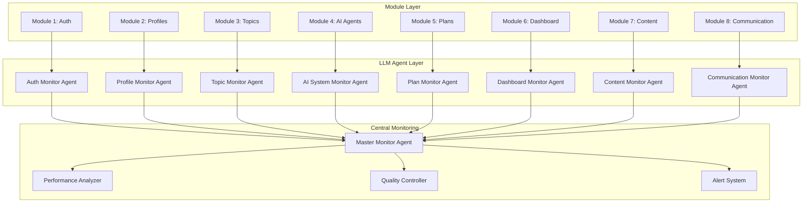

# 🤖 LLM Agent Monitoring System

## 🎯 **System Overview**
Real-time monitoring and feedback system using LLM agents to oversee each module's development, performance, and quality.

## 🏗️ **Architecture**

## 🔍 **Individual Module Agents**

### **1. Auth Monitor Agent** 🔐
**Purpose:** Monitor authentication system health and security

**Monitoring Areas:**
- Login success/failure rates
- Registration completion rates
- Password reset success
- Security incident detection
- User role management accuracy

**Real-time Alerts:**
- Failed login attempts >5 in 5 minutes
- Registration drop-off >20%
- Unusual authentication patterns
- Role permission violations

**Feedback Loop:**
- Security recommendations
- UX improvement suggestions
- Performance optimization tips
- Compliance reminders

---

### **2. Profile Monitor Agent** 👶
**Purpose:** Monitor child profile system quality and usage

**Monitoring Areas:**
- Profile creation completion
- Profile update frequency
- Data quality metrics
- User engagement patterns
- Family management efficiency

**Real-time Alerts:**
- Profile creation drop-off >15%
- Incomplete profile data >10%
- Profile update failures
- Data validation errors

**Feedback Loop:**
- Data quality improvements
- UX flow optimization
- Feature usage insights
- Performance recommendations

---

### **3. Topic Monitor Agent** 📚
**Purpose:** Monitor topic management system effectiveness

**Monitoring Areas:**
- Topic matching accuracy
- Content quality metrics
- User engagement with topics
- Topic diversity distribution
- Age-appropriateness validation

**Real-time Alerts:**
- Topic matching accuracy <80%
- Content quality score <3.5/5
- Low engagement topics
- Age-inappropriate content flags

**Feedback Loop:**
- Content quality improvements
- Matching algorithm optimization
- User engagement insights
- Content diversity recommendations

---

### **4. AI System Monitor Agent** 🤖
**Purpose:** Monitor AI agent performance and coordination

**Monitoring Areas:**
- Agent response times
- Agent accuracy rates
- Agent coordination efficiency
- System resource usage
- Error rates and types

**Real-time Alerts:**
- Agent response time >5 seconds
- Agent accuracy <85%
- Coordination failures
- Resource usage >80%
- Error rate >5%

**Feedback Loop:**
- Performance optimization
- Algorithm improvements
- Resource management
- Error prevention strategies

---

### **5. Plan Monitor Agent** 📅
**Purpose:** Monitor learning plan generation and effectiveness

**Monitoring Areas:**
- Plan generation success rate
- Plan completion rates
- User satisfaction scores
- Plan customization usage
- Learning outcome tracking

**Real-time Alerts:**
- Plan generation failure >10%
- Plan completion <60%
- User satisfaction <4.0/5
- Customization usage <30%

**Feedback Loop:**
- Plan generation improvements
- User engagement strategies
- Customization feature insights
- Learning outcome optimization

---

### **6. Dashboard Monitor Agent** 📊
**Purpose:** Monitor dashboard performance and user experience

**Monitoring Areas:**
- Page load times
- User interaction patterns
- Feature usage rates
- Error rates
- User satisfaction scores

**Real-time Alerts:**
- Page load time >3 seconds
- Error rate >2%
- Low feature usage
- User satisfaction <4.0/5

**Feedback Loop:**
- Performance optimization
- UX improvement suggestions
- Feature prioritization
- Error resolution strategies

---

### **7. Content Monitor Agent** 🎯
**Purpose:** Monitor content delivery system effectiveness

**Monitoring Areas:**
- Content access rates
- Learning material engagement
- Progress tracking accuracy
- Assessment completion rates
- Content quality scores

**Real-time Alerts:**
- Content access failure >5%
- Low engagement content
- Progress tracking errors
- Assessment drop-off >25%

**Feedback Loop:**
- Content quality improvements
- Engagement optimization
- Progress tracking accuracy
- Assessment effectiveness

---

### **8. Communication Monitor Agent** 📢
**Purpose:** Monitor communication system performance

**Monitoring Areas:**
- Notification delivery rates
- User engagement with notifications
- Communication tool usage
- Feedback collection rates
- Alert effectiveness

**Real-time Alerts:**
- Notification failure >5%
- Low notification engagement
- Communication tool errors
- Feedback collection <20%

**Feedback Loop:**
- Communication optimization
- Engagement strategies
- Tool improvement suggestions
- Feedback collection methods

## 🎯 **Master Monitor Agent**

### **Responsibilities:**
- Aggregate data from all module agents
- Identify cross-module dependencies
- Generate system-wide insights
- Coordinate optimization efforts
- Provide executive summaries

### **Monitoring Areas:**
- Overall system health
- Cross-module performance
- User journey optimization
- Business metrics tracking
- Resource allocation

### **Real-time Alerts:**
- System-wide performance issues
- Cross-module failures
- Business metric deviations
- Resource constraints
- Security threats

## 📊 **Performance Metrics Dashboard**

### **Real-time Metrics:**
- System uptime
- Response times
- Error rates
- User satisfaction
- Feature usage

### **Historical Trends:**
- Performance over time
- User growth patterns
- Feature adoption rates
- Quality improvements
- Business metrics

### **Predictive Insights:**
- Performance forecasting
- User behavior prediction
- Resource needs projection
- Quality trend analysis
- Business impact assessment

## 🔄 **Feedback Loop System**

### **Immediate Feedback:**
- Real-time alerts
- Performance warnings
- Quality notifications
- Security alerts

### **Daily Reports:**
- Performance summaries
- Quality metrics
- User engagement data
- System health status

### **Weekly Analysis:**
- Trend analysis
- Optimization recommendations
- Resource allocation suggestions
- Strategic insights

### **Monthly Reviews:**
- Comprehensive system analysis
- Business impact assessment
- Strategic recommendations
- Resource planning

## 🚀 **Implementation Strategy**

### **Phase 1: Core Monitoring (Week 1-2)**
- Implement basic monitoring for each module
- Set up real-time alerting
- Create performance dashboards

### **Phase 2: LLM Integration (Week 3-4)**
- Integrate LLM agents for each module
- Implement feedback loops
- Add predictive analytics

### **Phase 3: Advanced Analytics (Week 5-6)**
- Cross-module analysis
- Business intelligence
- Strategic recommendations

## 🎯 **Success Criteria**

### **Technical Metrics:**
- Real-time monitoring coverage: 100%
- Alert response time: <1 minute
- System health visibility: >95%
- Performance tracking: >90%

### **Business Metrics:**
- Issue detection rate: >95%
- Optimization recommendations: >80% accuracy
- User satisfaction improvement: >15%
- Performance improvement: >20%

---

**This system will provide continuous monitoring and real-time feedback to ensure each module meets quality standards and performance targets.**
