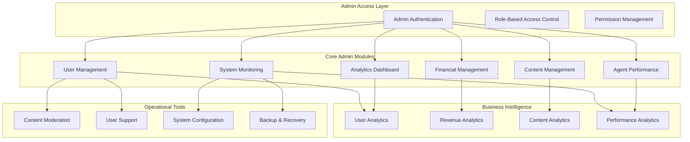

# 👑 Admin Dashboard Architecture

## 🎯 **Admin Dashboard Overview**
Comprehensive administrative interface for managing the entire Unschooling platform, monitoring system health, and overseeing business operations.

## 🏗️ **Admin Dashboard Architecture**



## 🔐 **Admin Access & Security**

### **Admin Roles:**
1. **Super Admin** - Full system access
2. **Content Admin** - Content management only
3. **User Admin** - User management only
4. **Analytics Admin** - Analytics and reporting only
5. **Support Admin** - User support and moderation only

### **Security Features:**
- Multi-factor authentication
- IP whitelisting
- Session timeout management
- Audit logging
- Permission-based access control

## 📊 **Core Admin Modules**

### **1. User Management Dashboard** 👥
**Purpose:** Comprehensive user administration and oversight

#### **Features:**
- **User Overview**
  - Total users count
  - Active users
  - New registrations (daily/weekly/monthly)
  - User growth trends

- **User Details**
  - User profiles
  - Subscription status
  - Usage statistics
  - Account activity

- **User Actions**
  - Account suspension/activation
  - Role management
  - Subscription management
  - Data export

- **User Analytics**
  - User engagement metrics
  - Feature usage patterns
  - User satisfaction scores
  - Churn analysis

#### **Real-time Monitoring:**
- User registration rates
- Login patterns
- Feature adoption rates
- User feedback scores

---

### **2. Content Management Dashboard** 📚
**Purpose:** Manage all learning content and topics

#### **Features:**
- **Content Overview**
  - Total topics count
  - Content quality scores
  - Age appropriateness validation
  - Content diversity metrics

- **Content Operations**
  - Topic CRUD operations
  - Content approval workflow
  - Quality control system
  - Content versioning

- **Content Analytics**
  - Topic popularity
  - User engagement rates
  - Learning effectiveness
  - Content gaps analysis

- **Content Moderation**
  - Inappropriate content flags
  - Quality review queue
  - Content update tracking
  - Moderation history

#### **Real-time Monitoring:**
- Content quality scores
- User engagement rates
- Moderation queue status
- Content update frequency

---

### **3. System Monitoring Dashboard** 🔧
**Purpose:** Monitor system health and performance

#### **Features:**
- **System Health**
  - Server status
  - Database performance
  - API response times
  - Error rates

- **Performance Metrics**
  - Page load times
  - User session duration
  - Feature response times
  - Resource usage

- **Error Tracking**
  - Error logs
  - Crash reports
  - Performance bottlenecks
  - System alerts

- **Infrastructure**
  - Server resources
  - Database connections
  - CDN performance
  - Backup status

#### **Real-time Monitoring:**
- System uptime
- Response times
- Error rates
- Resource usage

---

### **4. Analytics Dashboard** 📈
**Purpose:** Business intelligence and insights

#### **Features:**
- **User Analytics**
  - User growth trends
  - Engagement metrics
  - Feature adoption
  - User journey analysis

- **Business Metrics**
  - Revenue trends
  - Subscription rates
  - Churn analysis
  - Customer lifetime value

- **Content Analytics**
  - Learning outcomes
  - Topic effectiveness
  - User satisfaction
  - Content performance

- **Operational Analytics**
  - System performance
  - Agent effectiveness
  - Support metrics
  - Quality indicators

#### **Real-time Monitoring:**
- Key performance indicators
- Business metrics
- User behavior patterns
- System performance trends

---

### **5. Financial Management Dashboard** 💰
**Purpose:** Track revenue and financial performance

#### **Features:**
- **Revenue Overview**
  - Total revenue
  - Monthly recurring revenue
  - Revenue growth
  - Revenue per user

- **Subscription Management**
  - Active subscriptions
  - Subscription plans
  - Upgrade/downgrade rates
  - Payment processing

- **Financial Analytics**
  - Customer acquisition cost
  - Customer lifetime value
  - Churn impact on revenue
  - Revenue forecasting

- **Billing Operations**
  - Payment processing
  - Refund management
  - Invoice generation
  - Tax calculations

#### **Real-time Monitoring:**
- Revenue metrics
- Subscription changes
- Payment processing
- Financial alerts

---

### **6. Agent Performance Dashboard** 🤖
**Purpose:** Monitor AI agent effectiveness and optimization

#### **Features:**
- **Agent Overview**
  - Agent status
  - Response times
  - Accuracy rates
  - Error rates

- **Performance Metrics**
  - Topic matching accuracy
  - Plan generation success
  - User satisfaction scores
  - Learning outcomes

- **Agent Analytics**
  - Performance trends
  - Optimization opportunities
  - Resource usage
  - Coordination efficiency

- **Quality Control**
  - Output validation
  - Quality scoring
  - Continuous improvement
  - A/B testing results

#### **Real-time Monitoring:**
- Agent performance
- Quality metrics
- Error rates
- Optimization opportunities

## 🎯 **Admin Dashboard Features**

### **Real-time Notifications:**
- System alerts
- Performance warnings
- Security alerts
- Business metric alerts

### **Quick Actions:**
- User management
- Content moderation
- System configuration
- Support ticket handling

### **Data Export:**
- User data export
- Analytics reports
- Financial reports
- System logs

### **Bulk Operations:**
- User management
- Content updates
- System configuration
- Data maintenance

## 📱 **Admin Dashboard UI/UX**

### **Layout Structure:**
```
┌─────────────────────────────────────────────────────────┐
│ Header: Logo, Navigation, User Menu, Notifications    │
├─────────────────────────────────────────────────────────┤
│ Sidebar: Module Navigation, Quick Actions             │
├─────────────────────────────────────────────────────────┤
│ Main Content: Dashboard Widgets, Data Tables, Forms   │
├─────────────────────────────────────────────────────────┤
│ Footer: System Status, Version Info, Support Links    │
└─────────────────────────────────────────────────────────┘
```

### **Dashboard Widgets:**
- **System Status Cards**
  - Uptime percentage
  - Active users
  - System load
  - Error rate

- **Performance Charts**
  - Response time trends
  - User growth
  - Revenue trends
  - Feature usage

- **Quick Action Buttons**
  - User management
  - Content moderation
  - System configuration
  - Support tools

- **Alert Panels**
  - Critical alerts
  - Performance warnings
  - Security notifications
  - Business alerts

## 🔄 **Admin Workflow Integration**

### **Content Moderation Workflow:**
1. Content flagged for review
2. Admin notification
3. Review and decision
4. Action taken
5. Audit trail updated

### **User Support Workflow:**
1. Support ticket created
2. Admin assignment
3. Investigation and resolution
4. User notification
5. Ticket closure

### **System Maintenance Workflow:**
1. Maintenance scheduled
2. User notification
3. System maintenance
4. Verification
5. User notification

## 📊 **Admin Dashboard Metrics**

### **Key Performance Indicators:**
- System uptime: >99.9%
- User satisfaction: >4.5/5
- Content quality: >4.0/5
- Agent accuracy: >90%
- Revenue growth: >20% month-over-month

### **Real-time Alerts:**
- System downtime
- Performance degradation
- Security incidents
- Business metric deviations
- User satisfaction drops

## 🚀 **Implementation Strategy**

### **Phase 1: Core Admin (Week 1-2)**
- Basic admin authentication
- User management
- Content management
- System monitoring

### **Phase 2: Analytics (Week 3-4)**
- Analytics dashboard
- Performance metrics
- Business intelligence
- Reporting system

### **Phase 3: Advanced Features (Week 5-6)**
- Financial management
- Agent performance
- Advanced analytics
- Workflow automation

## 🎯 **Success Criteria**

### **Technical Metrics:**
- Admin dashboard load time: <2 seconds
- Real-time data refresh: <30 seconds
- Export functionality: 100% working
- Permission system: 100% accurate

### **Business Metrics:**
- Admin efficiency improvement: >30%
- Issue resolution time: <2 hours
- System visibility: >95%
- Decision support accuracy: >90%

---

**This admin dashboard will provide comprehensive oversight and management capabilities for the entire Unschooling platform.**
