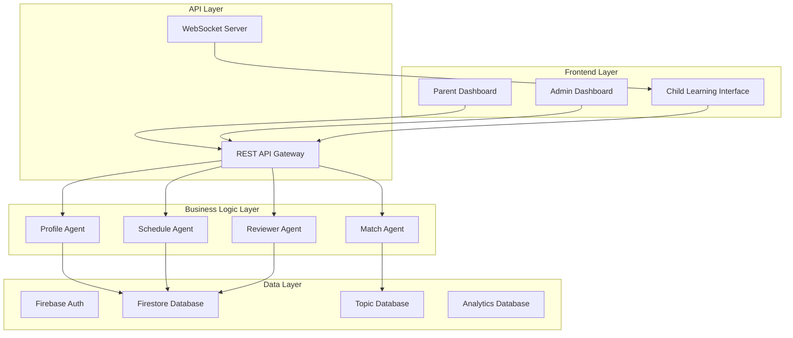

# 🏗️ Unschooling Platform - Main Architecture

## 🎯 **System Overview**
A comprehensive educational platform that uses AI agents to create personalized learning experiences for children aged 5-12.

## 🏛️ **High-Level Architecture**

## 👥 **User Roles & Access**

### **Parent Role**
- Manage child profiles
- View learning plans
- Track progress
- Generate new plans
- Basic analytics

### **Admin Role**
- User management
- Content management
- System monitoring
- Analytics dashboard
- Agent performance tracking
- Financial reporting

### **Child Role** (Future)
- Interactive learning interface
- Progress tracking
- Achievement system

## 🔐 **Module 1: Authentication & User Management**

### **Sub-Modules:**
1. **User Registration & Login**
   - Email/password authentication
   - Social login (Google, Facebook)
   - Password reset functionality
   - Email verification

2. **Role Management**
   - Role assignment (Parent/Admin)
   - Permission system
   - Access control lists

3. **User Profiles**
   - Personal information
   - Preferences
   - Subscription status
   - Account settings

4. **Session Management**
   - JWT tokens
   - Session persistence
   - Security policies

## 👶 **Module 2: Child Profile Management**

### **Sub-Modules:**
1. **Profile Creation**
   - Basic information (name, age, gender)
   - Learning preferences
   - Interest selection
   - Goal setting

2. **Profile Management**
   - Edit profiles
   - Profile templates
   - Bulk operations
   - Profile cloning

3. **Learning History**
   - Completed topics
   - Progress tracking
   - Achievement records
   - Learning patterns

4. **Family Management**
   - Multiple children per parent
   - Family grouping
   - Shared preferences

## 📚 **Module 3: Topic Management System**

### **Sub-Modules:**
1. **Topic Database**
   - Topic CRUD operations
   - Category management
   - Difficulty levels
   - Age appropriateness

2. **Content Management**
   - Learning materials
   - Worksheets
   - Video/audio content
   - Interactive elements

3. **Topic Relationships**
   - Prerequisites
   - Related topics
   - Learning paths
   - Topic chains

4. **Quality Control**
   - Content review system
   - Rating system
   - Feedback collection
   - Content updates

## 🤖 **Module 4: AI Agent System**

### **Sub-Modules:**
1. **Profile Agent**
   - Child analysis
   - Learning style detection
   - Interest mapping
   - Profile optimization

2. **Match Agent**
   - Topic matching algorithm
   - Interest alignment
   - Age appropriateness
   - Diversity optimization

3. **Schedule Agent**
   - Weekly planning
   - Activity scheduling
   - Time management
   - Progress milestones

4. **Reviewer Agent**
   - Plan optimization
   - Learning effectiveness
   - Engagement metrics
   - Continuous improvement

5. **Agent Coordinator**
   - Workflow management
   - Agent communication
   - Result aggregation
   - Performance monitoring

## 📅 **Module 5: Learning Plan Management**

### **Sub-Modules:**
1. **Plan Generation**
   - Automated creation
   - Template-based plans
   - Customization options
   - Plan variations

2. **Plan Management**
   - Plan editing
   - Version control
   - Plan sharing
   - Plan archiving

3. **Progress Tracking**
   - Milestone tracking
   - Completion status
   - Time tracking
   - Performance metrics

4. **Plan Analytics**
   - Success rates
   - Learning patterns
   - Optimization insights
   - ROI analysis

## 📊 **Module 6: Dashboard & Analytics**

### **Sub-Modules:**
1. **Parent Dashboard**
   - Child overview
   - Progress summary
   - Recent activities
   - Quick actions

2. **Admin Dashboard**
   - System overview
   - User statistics
   - Revenue metrics
   - Performance indicators

3. **Analytics Engine**
   - Data collection
   - Metric calculation
   - Trend analysis
   - Predictive insights

4. **Reporting System**
   - Automated reports
   - Custom reports
   - Export functionality
   - Scheduled reports

## 🎯 **Module 7: Content Delivery System**

### **Sub-Modules:**
1. **Learning Interface**
   - Interactive lessons
   - Progress tracking
   - Achievement system
   - Gamification elements

2. **Content Repository**
   - Media management
   - File organization
   - Version control
   - Content distribution

3. **Assessment System**
   - Quizzes
   - Progress tests
   - Skill evaluations
   - Learning outcomes

4. **Adaptive Learning**
   - Difficulty adjustment
   - Personalized content
   - Learning paths
   - Remedial content

## 📢 **Module 8: Communication & Notifications**

### **Sub-Modules:**
1. **Notification System**
   - Email notifications
   - Push notifications
   - In-app alerts
   - SMS reminders

2. **Communication Tools**
   - Parent-teacher chat
   - Progress updates
   - Achievement sharing
   - Family communication

3. **Alert Management**
   - Custom alerts
   - Alert preferences
   - Alert history
   - Alert scheduling

4. **Feedback System**
   - User feedback
   - Content ratings
   - Improvement suggestions
   - Bug reports

## 🔄 **Development Phases**

### **Phase 1: Foundation (Weeks 1-3)**
- Complete Module 1 (Authentication)
- Complete Module 2 (Child Profiles)
- Complete Module 3 (Topic Management)

### **Phase 2: Core Logic (Weeks 4-6)**
- Complete Module 4 (AI Agents)
- Complete Module 5 (Learning Plans)

### **Phase 3: User Experience (Weeks 7-9)**
- Complete Module 6 (Dashboard)
- Complete Module 7 (Content Delivery)

### **Phase 4: Polish & Scale (Weeks 10-12)**
- Complete Module 8 (Communication)
- Testing & Optimization
- Performance tuning

## 🎯 **Success Metrics**

### **Technical Metrics**
- System uptime: 99.9%
- Response time: <200ms
- User satisfaction: >4.5/5
- Bug resolution: <24 hours

### **Business Metrics**
- User retention: >80%
- Plan completion: >70%
- Parent satisfaction: >4.5/5
- Revenue growth: >20% month-over-month

## 🚀 **Next Steps**

1. **Review this architecture** and provide feedback
2. **Choose your starting module** (recommend Module 1)
3. **Set up development environment** for the chosen module
4. **Begin implementation** with clear milestones
5. **Set up monitoring** for the module

---

*This document will be updated as development progresses and requirements evolve.*
