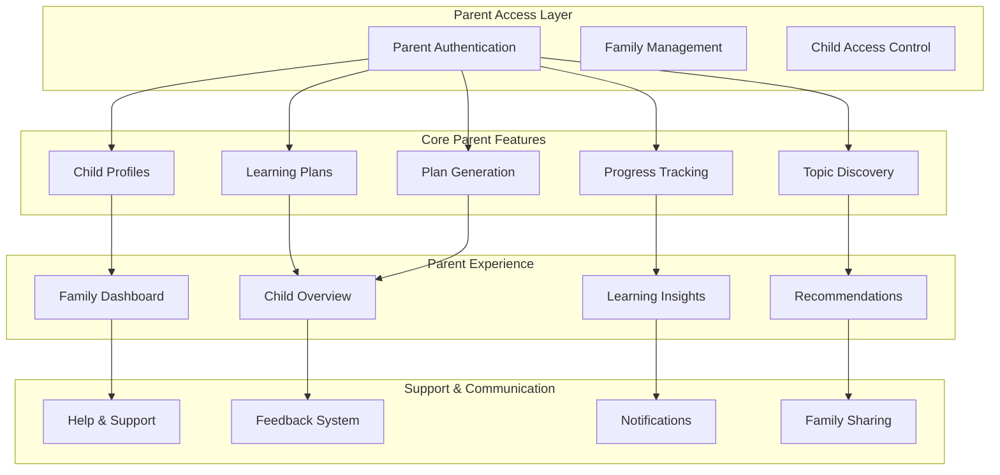

# 👨‍👩‍👧‍👦 Parent Dashboard Architecture

## 🎯 **Parent Dashboard Overview**
User-friendly interface designed specifically for parents to manage their children's learning journey, track progress, and generate personalized learning plans.

## 🏗️ **Parent Dashboard Architecture**



## 👥 **Parent User Experience**

### **Parent Journey:**
1. **Onboarding** - Account setup and child profile creation
2. **Discovery** - Explore learning topics and plans
3. **Planning** - Generate personalized learning plans
4. **Monitoring** - Track progress and learning outcomes
5. **Optimization** - Adjust plans based on feedback

### **Key Parent Needs:**
- **Simplicity** - Easy to use, intuitive interface
- **Insights** - Clear understanding of child's progress
- **Control** - Ability to customize and adjust plans
- **Confidence** - Trust in the learning approach
- **Time Efficiency** - Quick access to important information

## 🧩 **Core Parent Modules**

### **1. Family Dashboard** 🏠
**Purpose:** Central hub for managing all children and family learning

#### **Features:**
- **Family Overview**
  - Number of children
  - Overall family progress
  - Family learning goals
  - Shared achievements

- **Child Quick Access**
  - Individual child cards
  - Quick status overview
  - Recent activities
  - Quick actions

- **Family Calendar**
  - Learning schedules
  - Important dates
  - Family activities
  - Progress milestones

- **Family Insights**
  - Learning patterns
  - Family strengths
  - Areas for improvement
  - Success celebrations

#### **Real-time Updates:**
- Child progress updates
- New achievements
- Schedule changes
- Learning milestones

---

### **2. Child Profile Management** 👶
**Purpose:** Comprehensive child profile creation and management

#### **Features:**
- **Profile Creation**
  - Basic information (name, age, gender)
  - Learning preferences
  - Interest selection
  - Goal setting
  - Learning style assessment

- **Profile Management**
  - Edit profiles
  - Update preferences
  - Add new interests
  - Modify goals
  - Learning style updates

- **Profile Insights**
  - Learning preferences analysis
  - Interest development trends
  - Goal achievement tracking
  - Learning style effectiveness

- **Profile Templates**
  - Age-based templates
  - Interest-based templates
  - Goal-based templates
  - Custom templates

#### **Real-time Features:**
- Profile completion status
- Preference updates
- Goal progress tracking
- Learning style insights

---

### **3. Learning Plan Management** 📅
**Purpose:** Create, customize, and manage personalized learning plans

#### **Features:**
- **Plan Generation**
  - AI-powered plan creation
  - Customization options
  - Plan variations
  - Quick plan generation

- **Plan Management**
  - View current plans
  - Edit plan details
  - Adjust schedules
  - Modify activities

- **Plan Customization**
  - Topic selection
  - Difficulty adjustment
  - Schedule modification
  - Activity preferences

- **Plan Templates**
  - Weekly templates
  - Monthly templates
  - Special occasion templates
  - Custom templates

#### **Real-time Updates:**
- Plan generation progress
- Plan modification status
- Schedule updates
- Activity changes

---

### **4. Progress Tracking** 📊
**Purpose:** Monitor and visualize child learning progress

#### **Features:**
- **Progress Overview**
  - Overall progress percentage
  - Subject-wise progress
  - Skill development
  - Achievement tracking

- **Progress Details**
  - Individual topic progress
  - Time spent learning
  - Completion rates
  - Performance metrics

- **Progress Visualization**
  - Progress charts
  - Learning timelines
  - Achievement badges
  - Milestone tracking

- **Progress Insights**
  - Learning patterns
  - Strengths identification
  - Areas for improvement
  - Success factors

#### **Real-time Monitoring:**
- Progress updates
- Achievement notifications
- Milestone alerts
- Performance insights

---

### **5. Topic Discovery** 🔍
**Purpose:** Explore and discover learning topics and content

#### **Features:**
- **Topic Browsing**
  - Category-based browsing
  - Age-appropriate filtering
  - Interest-based search
  - Difficulty level filtering

- **Topic Information**
  - Detailed descriptions
  - Learning objectives
  - Age appropriateness
  - Difficulty levels
  - Estimated time

- **Topic Recommendations**
  - AI-powered suggestions
  - Interest-based recommendations
  - Age-appropriate suggestions
  - Skill-based recommendations

- **Topic Favorites**
  - Save interesting topics
  - Create topic lists
  - Share with family
  - Plan for future

#### **Real-time Features:**
- Topic availability updates
- New topic notifications
- Recommendation updates
- Favorites synchronization

---

### **6. Plan Generation** 🚀
**Purpose:** Generate personalized learning plans using AI agents

#### **Features:**
- **Quick Generation**
  - One-click plan creation
  - AI-powered customization
  - Instant plan preview
  - Quick modifications

- **Advanced Generation**
  - Detailed customization
  - Multiple plan options
  - Plan comparison
  - Expert recommendations

- **Generation Options**
  - Weekly plans
  - Monthly plans
  - Special focus plans
  - Review and practice plans

- **Generation History**
  - Previous plans
  - Plan effectiveness
  - Modification history
  - Success patterns

#### **Real-time Updates:**
- Generation progress
- Plan availability
- Customization options
- AI recommendations

## 🎨 **Parent Dashboard UI/UX**

### **Design Principles:**
- **Simplicity** - Clean, uncluttered interface
- **Intuitiveness** - Easy navigation and understanding
- **Efficiency** - Quick access to important features
- **Engagement** - Motivating and encouraging design
- **Accessibility** - Easy to use on all devices

### **Layout Structure:**
```
┌─────────────────────────────────────────────────────────┐
│ Header: Logo, Family Menu, Notifications, Help        │
├─────────────────────────────────────────────────────────┤
│ Sidebar: Family Navigation, Quick Actions             │
├─────────────────────────────────────────────────────────┤
│ Main Content: Family Overview, Child Cards, Plans     │
├─────────────────────────────────────────────────────────┤
│ Footer: Support, Feedback, Family Resources           │
└─────────────────────────────────────────────────────────┘
```

### **Dashboard Widgets:**
- **Family Overview Cards**
  - Total children
  - Family progress
  - Recent achievements
  - Quick actions

- **Child Progress Cards**
  - Individual progress
  - Recent activities
  - Learning milestones
  - Quick access

- **Learning Plan Widgets**
  - Current plans
  - Plan status
  - Upcoming activities
  - Plan generation

- **Progress Charts**
  - Overall progress
  - Subject progress
  - Skill development
  - Achievement tracking

## 🔄 **Parent Workflow Integration**

### **Daily Learning Workflow:**
1. Check family dashboard
2. Review child progress
3. Execute learning plans
4. Update progress
5. Plan next day

### **Weekly Planning Workflow:**
1. Review weekly progress
2. Generate new plans
3. Customize activities
4. Schedule learning time
5. Set weekly goals

### **Monthly Review Workflow:**
1. Monthly progress review
2. Goal achievement assessment
3. Plan effectiveness evaluation
4. Strategy adjustment
5. New goal setting

## 📱 **Mobile-First Design**

### **Mobile Features:**
- **Responsive Design** - Works on all screen sizes
- **Touch-Friendly** - Easy navigation on mobile
- **Offline Access** - Basic functionality without internet
- **Push Notifications** - Important updates and reminders
- **Quick Actions** - Easy access to common tasks

### **Mobile Optimization:**
- **Fast Loading** - Optimized for mobile networks
- **Battery Efficient** - Minimal battery usage
- **Data Friendly** - Optimized data usage
- **Accessibility** - Easy to use for all users

## 🔍 **Parent Analytics & Insights**

### **Personal Insights:**
- **Learning Patterns** - How children learn best
- **Progress Trends** - Development over time
- **Interest Evolution** - Changing interests and preferences
- **Success Factors** - What leads to better learning

### **Family Insights:**
- **Family Learning Style** - How family learns together
- **Shared Interests** - Common learning areas
- **Collaboration Opportunities** - Family learning activities
- **Support Strategies** - How to support each child

## 🚀 **Implementation Strategy**

### **Phase 1: Core Features (Week 1-2)**
- Family dashboard
- Child profile management
- Basic progress tracking

### **Phase 2: Learning Plans (Week 3-4)**
- Plan generation
- Plan management
- Progress tracking

### **Phase 3: Advanced Features (Week 5-6)**
- Topic discovery
- Advanced analytics
- Mobile optimization

## 🎯 **Success Criteria**

### **User Experience Metrics:**
- Dashboard load time: <2 seconds
- Feature discovery: <3 clicks
- Task completion: >90%
- User satisfaction: >4.5/5

### **Engagement Metrics:**
- Daily active users: >80%
- Feature usage: >70%
- Plan completion: >75%
- Progress tracking: >90%

---

**This parent dashboard will provide an intuitive and engaging experience for parents to manage their children's learning journey effectively.**
