# Unschooling Website Structure & Page Categorization

## Complete Page Inventory

### 🔧 ADMIN FACING (Internal - 25+ Pages)

#### **Core Dashboards**
- AdminPanel
- AdminDashboard  
- UltimateAdminDashboard
- ComprehensiveAdminDashboard
- SimpleAdminDashboard

#### **Content Management**
- ContentManagement
- ContentManagementMain
- ContentInventory
- ExistingContentAnalytics

#### **User & Progress Tracking**
- ChildProgressDashboard
- ChildActivityDashboard
- AdminTracker
- AdminSchedule

#### **Business Intelligence**
- BusinessIntelligenceDashboard
- PerformanceDashboard
- MonitoringDashboard
- MLDashboard

#### **Security & Compliance**
- SecurityDashboard
- AdvancedSecurityDashboard
- ComplianceDashboard

#### **Operations**
- OrderManagement
- AgentReporting
- StreamlinedAgentDashboard
- AdminProjects
- AdminLaunch

#### **Advanced Features**
- GamificationDashboard
- PersonalizationDashboard
- InnovationDashboard
- IntegrationDashboard
- InfrastructureDashboard
- LaunchDashboard
- PostLaunchOptimizationDashboard
- GlobalExpansionDashboard
- EnterpriseDashboard

---

### 👥 CUSTOMER FACING (External - 20+ Pages)

#### **BEFORE LOGIN (Public - 8 Pages)**
- **Marketing & Information:**
  - MainPage (Homepage)
  - About
  - EssentialGrowthMainPage
  - PlansMainPage (Pricing)
  - NichesMainPage
  - DynamicNichePage
  - DynamicTopicPage
  - TopicDetailPage

- **Authentication:**
  - AuthForm (Login/Register)
  - PasswordReset
  - FirebaseConnectivityTest

#### **AFTER LOGIN (Protected - 12+ Pages)**
- **Core Learning Experience:**
  - Home (Dashboard)
  - Learning
  - EnhancedLearningDashboard
  - LearningProgressTracker
  - ProgressDashboard
  - CustomisedWeeklyPlan

- **User Management:**
  - UserProfile
  - ChildProfilePage (ProfileForm)
  - Settings
  - Help
  - BillingDashboard

- **Content & Progress:**
  - UnifiedDashboard
  - CustomerJourney
  - ParentDeliveryPortal

- **Testing & Development:**
  - BackButtonTestPage

---

## Website Flow Diagram

```mermaid
graph TB
    %% Main Entry Point
    Start([🌐 Website Entry]) --> AuthCheck{User Authenticated?}
    
    %% Public Pages (Before Login)
    AuthCheck -->|No| PublicPages[📱 PUBLIC PAGES]
    PublicPages --> HomePage[🏠 Homepage<br/>MainPage]
    PublicPages --> About[ℹ️ About]
    PublicPages --> EssentialGrowth[🌱 Essential Growth]
    PublicPages --> Plans[💰 Pricing Plans]
    PublicPages --> Niches[🎯 Learning Niches]
    PublicPages --> Topics[📚 Topic Details]
    PublicPages --> Login[🔐 Login/Register]
    PublicPages --> PasswordReset[🔑 Password Reset]
    
    %% Authentication Flow
    Login --> AuthSuccess{Authentication<br/>Successful?}
    AuthSuccess -->|Yes| ProtectedPages[🔒 PROTECTED PAGES]
    AuthSuccess -->|No| Login
    
    %% Protected Customer Pages (After Login)
    ProtectedPages --> CustomerDashboard[👤 Customer Dashboard]
    CustomerDashboard --> Learning[📖 Learning Hub]
    CustomerDashboard --> Progress[📊 Progress Tracking]
    CustomerDashboard --> Profile[👨‍👩‍👧‍👦 Child Profiles]
    CustomerDashboard --> Settings[⚙️ Settings]
    CustomerDashboard --> Billing[💳 Billing]
    CustomerDashboard --> Help[❓ Help Center]
    
    %% Admin Section
    AuthCheck -->|Admin Access| AdminSection[🛠️ ADMIN SECTION]
    AdminSection --> AdminDashboard[📊 Admin Dashboard]
    AdminSection --> ContentMgmt[📝 Content Management]
    AdminSection --> UserTracking[👥 User Tracking]
    AdminSection --> Analytics[📈 Analytics]
    AdminSection --> Security[🔒 Security]
    AdminSection --> Operations[⚙️ Operations]
    
    %% Admin Subcategories
    ContentMgmt --> ContentLibrary[📚 Content Library]
    ContentMgmt --> ContentAnalytics[📊 Content Analytics]
    ContentMgmt --> ContentInventory[📦 Content Inventory]
    
    UserTracking --> ChildProgress[👶 Child Progress]
    UserTracking --> ActivityTracking[🏃 Activity Tracking]
    UserTracking --> AdminTracker[📊 Admin Tracker]
    
    Analytics --> BusinessIntelligence[🧠 Business Intelligence]
    Analytics --> Performance[⚡ Performance Metrics]
    Analytics --> ML[🤖 ML Dashboard]
    Analytics --> Monitoring[👁️ Monitoring]
    
    Security --> SecurityDashboard[🛡️ Security Dashboard]
    Security --> Compliance[📋 Compliance]
    Security --> AdvancedSecurity[🔐 Advanced Security]
    
    Operations --> OrderMgmt[📦 Order Management]
    Operations --> AgentReporting[🤖 Agent Reporting]
    Operations --> Projects[📋 Projects]
    Operations --> Launch[🚀 Launch Management]
    
    %% Styling
    classDef publicPages fill:#e1f5fe,stroke:#01579b,stroke-width:2px,color:#000
    classDef protectedPages fill:#f3e5f5,stroke:#4a148c,stroke-width:2px,color:#000
    classDef adminPages fill:#fff3e0,stroke:#e65100,stroke-width:2px,color:#000
    classDef authPages fill:#e8f5e8,stroke:#2e7d32,stroke-width:2px,color:#000
    
    class PublicPages,HomePage,About,EssentialGrowth,Plans,Niches,Topics,Login,PasswordReset publicPages
    class ProtectedPages,CustomerDashboard,Learning,Progress,Profile,Settings,Billing,Help protectedPages
    class AdminSection,AdminDashboard,ContentMgmt,UserTracking,Analytics,Security,Operations adminPages
    class AuthCheck,AuthSuccess authPages
```

## Key Features by Section

### 🎯 **Public Pages (Before Login)**
- **Marketing Focus**: Homepage, About, Essential Growth
- **Pricing & Plans**: Transparent pricing information
- **Content Discovery**: Niches and Topics exploration
- **Authentication**: Login, Register, Password Reset

### 🔒 **Protected Pages (After Login)**
- **Personalized Learning**: Custom learning paths
- **Progress Tracking**: Individual child progress
- **Profile Management**: Child profiles and settings
- **Billing & Support**: Account management

### 🛠️ **Admin Pages (Internal)**
- **Content Management**: Full content lifecycle
- **User Analytics**: Comprehensive user tracking
- **Business Intelligence**: Advanced analytics
- **Security & Compliance**: Enterprise-grade security
- **Operations**: Order management, agent monitoring

## Navigation Flow

1. **Public User Journey**: Homepage → Explore Content → View Plans → Login → Dashboard
2. **Authenticated User Journey**: Dashboard → Learning → Progress → Profile Management
3. **Admin Journey**: Admin Dashboard → Content/User Management → Analytics → Operations

This structure provides clear separation between public marketing content, authenticated user features, and comprehensive admin functionality.
